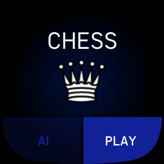

# FitBit-Chess

This game allows two modes of game. The first mode "player vs player" allows you to play against another player on the same device. The second mode "AI" turn on an artificial intelligence that will play as a black player. The game shows you how you can move with individual figures and warns you if the move is not a legal "king under attack". If the checkmate occurs, the game is automatically terminated and the winners of the game is displayed. A connection to the telephone is required to play in AI (all AI calculations are performed on the telephone).

## Control
  * __"player vs player" mode:__ Press Play button
  * __"AI" mode:__ Press AI button
  * To return to the __main menu__ or __end the game prematurely__, it is necessary to close the application and turn it on again
  
## Setting
  * You can set the chessboard colors on your phone. it is also possible to set the performance of artificial intelligence (level 1 - 4)

## Screenshots

  
  
  

Author: __Martin Krčma__
